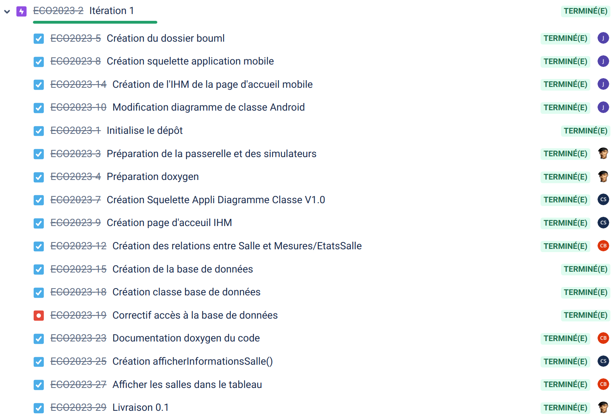

 

 [](https://github.com/btssn-lasalle-84/eco-classroom-2023/actions/workflows/make-qt.yml) [](https://github.com/btssn-lasalle-84/eco-classroom-2023/actions/workflows/android-build.yml) [](https://github.com/btssn-lasalle-84/eco-classroom-2023/actions/workflows/pages/pages-build-deployment)

# Le projet eco-classroom 2023

- [Le projet eco-classroom 2023](#le-projet-eco-classroom-2023)
  - [Fonctionnalités](#fonctionnalit%C3%A9s)
  - [Documentation du code](#documentation-du-code)
  - [Présentations](#pr%C3%A9sentations)
  - [Vidéo](#vid%C3%A9o)
  - [Diagramme de classes](#diagramme-de-classes)
  - [Screenshots](#screenshots)
  - [Historique des versions](#historique-des-versions)
    - [1.0](#10)
    - [0.2](#02)
    - [0.1](#01)
  - [Base de données](#base-de-donn%C3%A9es)
  - [MQTT](#mqtt)
    - [Qt MQTT](#qt-mqtt)
    - [Paho MQTT (Android)](#paho-mqtt-android)
  - [Auteurs](#auteurs)

---

Le système assure une supervision de salles dans un établissement scolaire. Chaque salle sera équipée de deux modules (sonde et détection) connectés afin de détecter (fenêtre, lumière et présence) et mesurer (température, hygrométrie et co2) l’état de celle-ci.


Les informations seront accessibles à partir d’une tablette et d’une application PC permettant aux personnels d’assurer un suivi et d’intervenir en conséquence.


## Fonctionnalités

- Version Android


- Version Qt


## Documentation du code

https://btssn-lasalle-84.github.io/eco-classroom-2023/

## Présentations

Diaporamas étudiants IR :

- Android :
    - Jérémy MERCKLEN : [Revue finale - Mercklen.pptx](./diaporamas/Revue%20finale%20-%20Mercklen.pptx)

- Qt :
    - Baptiste COCHET : [Revue finale - Cochet.pptx](./diaporamas/Revue%20finale%20-%20Cochet.pptx)
    - Célian SUBIRANA : [Revue finale - Subirana.pptx](./diaporamas/Revue%20finale%20-%20Subirana.pptx)

## Vidéo

https://www.youtube.com/@projets-btssn-lasalle84

## Diagramme de classes

- Android :


- Qt :


## Screenshots

- Android :


- PC Desktop Qt :


## Historique des versions


### 1.0


### 0.2


### 0.1



## Base de données

Base de données MySQL 8.0 `ecoclassroom` hébergée sur www.db4free.net (pour les tests) et en local (pour la phase de production) :


```sql
-- LDD (langage de définition de données)

-- Voir aussi : https://www.db4free.net/phpMyAdmin/

DROP DATABASE IF EXISTS `ecoclassroom`;

CREATE DATABASE IF NOT EXISTS `ecoclassroom` CHARACTER SET utf8;

--
-- Base de données : `ecoclassroom`
--

USE ecoclassroom;

DROP TABLE IF EXISTS Seuils;
DROP TABLE IF EXISTS MesureCo2;
DROP TABLE IF EXISTS MesureLuminosite;
DROP TABLE IF EXISTS MesureHumidite;
DROP TABLE IF EXISTS MesureTemperature;
DROP TABLE IF EXISTS BrokerMQTT;
DROP TABLE IF EXISTS IndiceQualiteAir;
DROP TABLE IF EXISTS IndiceConfinement;
DROP TABLE IF EXISTS IndiceInconfortIADI;
DROP TABLE IF EXISTS IndiceConfortTHI;
DROP TABLE IF EXISTS Salle;

-- --------------------------------------------------------

CREATE TABLE IF NOT EXISTS `IndiceConfortTHI` (
	`idIndiceConfortTHI`	int NOT NULL,
	`libelle`	varchar(255)
) ENGINE=InnoDB DEFAULT CHARSET=utf8;

ALTER TABLE `IndiceConfortTHI`
  ADD PRIMARY KEY (`idIndiceConfortTHI`);

INSERT INTO IndiceConfortTHI(idIndiceConfortTHI,libelle) VALUES
(-4,'inconnu'),
(-3,'froid'),
(-2,'frais'),
(-1,'légèrement frais'),
(0,'neutre'),
(1,'légèrement tiède'),
(2,'tiède'),
(3,'chaud');

CREATE TABLE IF NOT EXISTS `IndiceInconfortIADI` (
	`idIndiceInconfortIADI`	int NOT NULL,
	`libelle`	varchar(255)
) ENGINE=InnoDB DEFAULT CHARSET=utf8;

ALTER TABLE `IndiceInconfortIADI`
  ADD PRIMARY KEY (`idIndiceInconfortIADI`);

INSERT INTO IndiceInconfortIADI(idIndiceInconfortIADI,libelle) VALUES
(0,'aucun'),
(1,'gêne'),
(2,'mal être'),
(3,'inconfort'),
(4,'stress intense'),
(5,'urgence médicale');

CREATE TABLE IF NOT EXISTS `IndiceConfinement` (
	`idIndiceConfinement`	int NOT NULL,
	`libelle`	varchar(255)
) ENGINE=InnoDB DEFAULT CHARSET=utf8;

ALTER TABLE `IndiceConfinement`
  ADD PRIMARY KEY (`idIndiceConfinement`);

INSERT INTO IndiceConfinement(idIndiceConfinement,libelle) VALUES
(0, 'nul'),
(1, 'faible'),
(2, 'moyen'),
(3, 'élevé'),
(4, 'très élevé'),
(5, 'extrême');

CREATE TABLE IF NOT EXISTS `IndiceQualiteAir` (
	`idIndiceQualiteAir`	int NOT NULL,
	`libelle`	varchar(255)
) ENGINE=InnoDB DEFAULT CHARSET=utf8;

ALTER TABLE `IndiceQualiteAir`
  ADD PRIMARY KEY (`idIndiceQualiteAir`);

INSERT INTO IndiceQualiteAir(idIndiceQualiteAir,libelle) VALUES
(0,'inconnu'),
(1,'excellent'),
(2,'très bien'),
(3,'modéré'),
(4,'mauvais'),
(5,'très mauvais'),
(6,'sévère');

-- --------------------------------------------------------

CREATE TABLE IF NOT EXISTS `Salle` (
	`idSalle`	int NOT NULL AUTO_INCREMENT PRIMARY KEY,
	`nom`	varchar(32),
	`description`	varchar(255),
	`superficie`	int DEFAULT '0',
	`idIndiceConfortTHI`	int DEFAULT '-4',
    `idIndiceInconfortIADI`	int DEFAULT '0',
	`idIndiceQualiteAir`	int DEFAULT '0',
    `idIndiceConfinement`	int DEFAULT '0',
	`etatFenetres`	int DEFAULT '0',
	`etatLumieres`	int DEFAULT '0',
	`estOccupe`	int DEFAULT '0',
	`estFavori`	int DEFAULT '0'
) ENGINE=InnoDB DEFAULT CHARSET=utf8;

ALTER TABLE `Salle`
  ADD UNIQUE KEY `nom` (`nom`);

-- ALTER TABLE `Salle` CHANGE `idSalle` `idSalle` INT NOT NULL AUTO_INCREMENT, add PRIMARY KEY (`idSalle`); 

ALTER TABLE `Salle`
  ADD CONSTRAINT `Salle_fk_1` FOREIGN KEY (`idIndiceConfortTHI`) REFERENCES `IndiceConfortTHI` (`idIndiceConfortTHI`) ON DELETE CASCADE,
  ADD CONSTRAINT `Salle_fk_2` FOREIGN KEY (`idIndiceInconfortIADI`) REFERENCES `IndiceInconfortIADI` (`idIndiceInconfortIADI`) ON DELETE CASCADE,
  ADD CONSTRAINT `Salle_fk_3` FOREIGN KEY (`idIndiceQualiteAir`) REFERENCES `IndiceQualiteAir` (`idIndiceQualiteAir`) ON DELETE CASCADE,
  ADD CONSTRAINT `Salle_fk_4` FOREIGN KEY (`idIndiceConfinement`) REFERENCES `IndiceConfinement` (`idIndiceConfinement`) ON DELETE CASCADE;

-- --------------------------------------------------------

CREATE TABLE IF NOT EXISTS `BrokerMQTT` (
	`idBrokerMQTT`	int,
	`hostname`	varchar(255) NOT NULL,
	`port`	int NOT NULL DEFAULT '1883',
	`username`	varchar(64) DEFAULT NULL,
	`password`	varchar(64) DEFAULT NULL,
	`estActif`	int DEFAULT '0'
) ENGINE=InnoDB DEFAULT CHARSET=utf8;

ALTER TABLE `BrokerMQTT`
  ADD PRIMARY KEY (`idBrokerMQTT`);

-- --------------------------------------------------------

CREATE TABLE IF NOT EXISTS `MesureTemperature` (
	`idMesureTemperature`	int AUTO_INCREMENT PRIMARY KEY,
	`idSalle`	int NOT NULL,
	`temperature`	DECIMAL(3, 1) NOT NULL,
	`horodatage`	DATETIME NOT NULL
) ENGINE=InnoDB DEFAULT CHARSET=utf8;

ALTER TABLE `MesureTemperature`
  ADD UNIQUE KEY `horodatage` (`horodatage`),
  ADD KEY `MesureTemperature_fk_1` (`idSalle`);

ALTER TABLE `MesureTemperature`
  ADD CONSTRAINT `MesureTemperature_fk_1` FOREIGN KEY (`idSalle`) REFERENCES `Salle` (`idSalle`) ON DELETE CASCADE;

-- --------------------------------------------------------

CREATE TABLE IF NOT EXISTS `MesureHumidite` (
	`idMesureHumidite`	int AUTO_INCREMENT PRIMARY KEY,
	`idSalle`	int NOT NULL,
	`humidite`	TINYINT UNSIGNED NOT NULL,
	`horodatage`	DATETIME NOT NULL
) ENGINE=InnoDB DEFAULT CHARSET=utf8;

ALTER TABLE `MesureHumidite`
  ADD UNIQUE KEY `horodatage` (`horodatage`),
  ADD KEY `MesureHumidite_fk_1` (`idSalle`);

ALTER TABLE `MesureHumidite`
  ADD CONSTRAINT `MesureHumidite_fk_1` FOREIGN KEY (`idSalle`) REFERENCES `Salle` (`idSalle`) ON DELETE CASCADE;

-- --------------------------------------------------------

CREATE TABLE IF NOT EXISTS `MesureLuminosite` (
	`idMesureLuminosite`	int AUTO_INCREMENT PRIMARY KEY,
	`idSalle`	int NOT NULL,
	`luminosite`	SMALLINT UNSIGNED NOT NULL,
	`horodatage`	DATETIME NOT NULL
) ENGINE=InnoDB DEFAULT CHARSET=utf8;

ALTER TABLE `MesureLuminosite`
  ADD UNIQUE KEY `horodatage` (`horodatage`),
  ADD KEY `MesureLuminosite_fk_1` (`idSalle`);

ALTER TABLE `MesureLuminosite`
  ADD CONSTRAINT `MesureLuminosite_fk_1` FOREIGN KEY (`idSalle`) REFERENCES `Salle` (`idSalle`) ON DELETE CASCADE;

-- --------------------------------------------------------

CREATE TABLE IF NOT EXISTS `MesureCo2` (
	`idMesureCo2`	int AUTO_INCREMENT PRIMARY KEY,
	`idSalle`	int NOT NULL,
	`co2`	SMALLINT UNSIGNED NOT NULL,
	`horodatage`	DATETIME NOT NULL
) ENGINE=InnoDB DEFAULT CHARSET=utf8;

ALTER TABLE `MesureCo2`
  ADD UNIQUE KEY `horodatage` (`horodatage`),
  ADD KEY `MesureCo2_fk_1` (`idSalle`);

ALTER TABLE `MesureCo2`
  ADD CONSTRAINT `MesureCo2_fk_1` FOREIGN KEY (`idSalle`) REFERENCES `Salle` (`idSalle`) ON DELETE CASCADE;

-- --------------------------------------------------------

CREATE TABLE IF NOT EXISTS `Seuils` (
	`idSalle`	int NOT NULL,
	`temperatureMin`	double DEFAULT '14',
	`temperatureMax`	double DEFAULT '30',
	`luminositeMin`	int DEFAULT '300',
	`eclairementMoyen`	int DEFAULT '500',
	`humiditeMin`	int DEFAULT '45',
	`humiditeMax`	int DEFAULT '55',
	`co2Max`	int DEFAULT '1300',
    `indiceConfinement`	int DEFAULT '5'
) ENGINE=InnoDB DEFAULT CHARSET=utf8;

ALTER TABLE `Seuils`
  ADD PRIMARY KEY (`idSalle`);

ALTER TABLE `Seuils`
  ADD CONSTRAINT `Seuils_fk_1` FOREIGN KEY (`idSalle`) REFERENCES `Salle` (`idSalle`) ON DELETE CASCADE;
-- --------------------------------------------------------
```

## MQTT


Voir aussi : [modules-lora/README.md](modules-lora/README.md)

### Qt MQTT

[Qt MQTT](https://doc.qt.io/QtMQTT/index.html) fournit une implémentation conforme à la norme MQTT.

Qt MQTT fait parti de [Qt For Automation](http://doc.qt.io/QtForAutomation/qtautomation-overview.html) et pas directement de Qt. Il faut donc l'installer.

Installation :

1. Identifier la version de Qt :

```sh
$ qmake -v
QMake version 3.1
Using Qt version 5.12.8 in /usr/lib/x86_64-linux-gnu
```

Ici, la version de Qt est `5.12.8`.

2. Récupérer le code source du module `mqtt` en clonant le dépôt git

```sh
$ sudo git clone https://code.qt.io/qt/qtmqtt.git
$ cd qtmqtt/
```

3. Sélectionner la branche qui correspond à la version de Qt utilisée

```sh
$ sudo git checkout 5.12.8
```

4. Installer le paquet fournissant les fichiers d'en-tête de développement indépendants

```sh
$ sudo apt install qtbase5-private-dev
```

5. Fabriquer et installer le module `mqtt`

```sh
$ sudo qmake

$ sudo make

$ sudo make install
```

Pour accèder aux classes du module Qt MQTT, il faudra ajouter le module `mqtt` au fichier de projet `.pro` :

```
QT += mqtt
```

### Paho MQTT (Android)

Il faut ajouter les dépendances vers les bibliothèques nécessaires à l’utilisation du protocole MQTT : le client Paho MQTT et le service Android fournis par Eclipse.

Liens : [Eclipse Paho](https://www.eclipse.org/paho/) et [github](https://github.com/eclipse/paho.mqtt.java)

1. Il faut ajouter l’url d’Eclipse Paho dans le ficher `build.gradle` du projet :

```
buildscript {
    repositories {
        google()
        jcenter()
    }
    dependencies {
        classpath 'com.android.tools.build:gradle:3.1.3'
        // NOTE: Do not place your application dependencies here; they belong
        // in the individual module build.gradle files
    }
}

allprojects {
    repositories {
        google()
        jcenter()
        maven {
            url "https://repo.eclipse.org/content/repositories/paho-snapshots/"
        }
    }
}

task clean(type: Delete) {
    delete rootProject.buildDir
}
```

2. Puis, il faut ajouter les dépendances vers le client Paho MQTT et le service Android dans le fichier build.gradle du dossier `app` :

```
...
dependencies {
    ...

    implementation 'org.eclipse.paho:org.eclipse.paho.client.mqttv3:1.1.0'
    implementation 'org.eclipse.paho:org.eclipse.paho.android.service:1.1.1'
    implementation 'androidx.localbroadcastmanager:localbroadcastmanager:1.0.0'
}
```

3. L’utilisation du protocole MQTT suppose que l’on ait un accès réseau. Pour cela, on va attribuer les permissions `INTERNET`, `ACCESS_NETWORK_STATE`, `ACCESS_WIFI_STATE` et `WAKE_LOCK` à l’application Android dans son fichier `AndroidManifest.xml`. On ajoutera aussi le service `MqttService`.

```xml
<?xml version="1.0" encoding="utf-8"?>
<manifest xmlns:android="http://schemas.android.com/apk/res/android"
    ...>

    <uses-permission android:name="android.permission.INTERNET" />
    <uses-permission android:name="android.permission.ACCESS_NETWORK_STATE" />
    <uses-permission android:name="android.permission.ACCESS_WIFI_STATE" />
    <uses-permission android:name="android.permission.WAKE_LOCK"/>

    <application
        ...>
        ...
        <service android:name="org.eclipse.paho.android.service.MqttService" />
    </application>

</manifest>
```

## Auteurs

Étudiants IR :

- Jérémy MERCKLEN <mercklenjeremy@gmail.com>
- Baptiste COCHET <cochet.baptiste.pro@gmail.com>
- Célian SUBIRANA <celian.subirana.pro@gmail.com>

---
©️ LaSalle Avignon 2023
