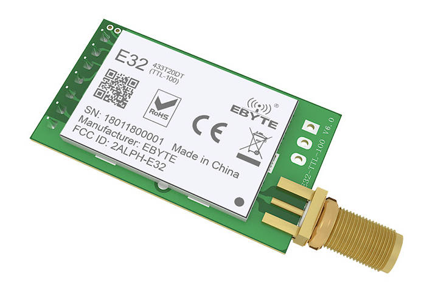
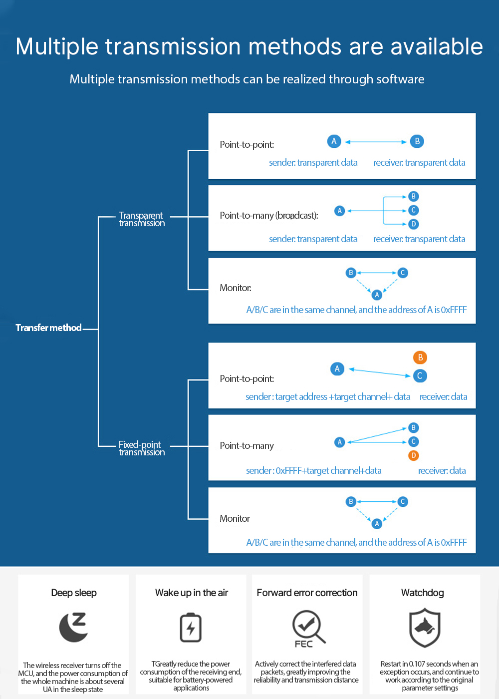
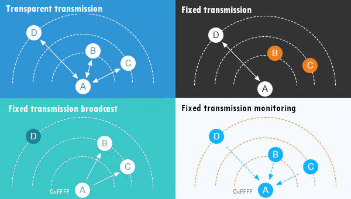
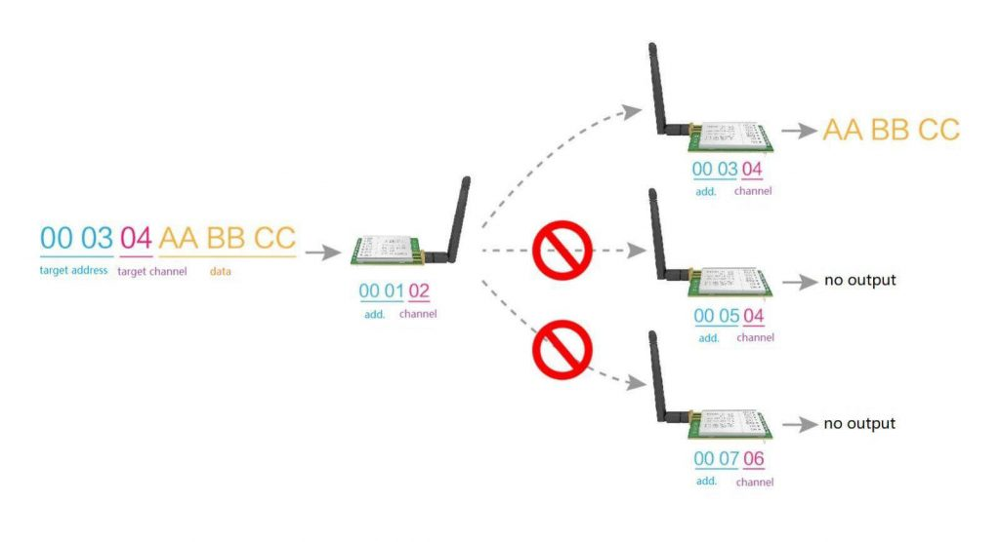
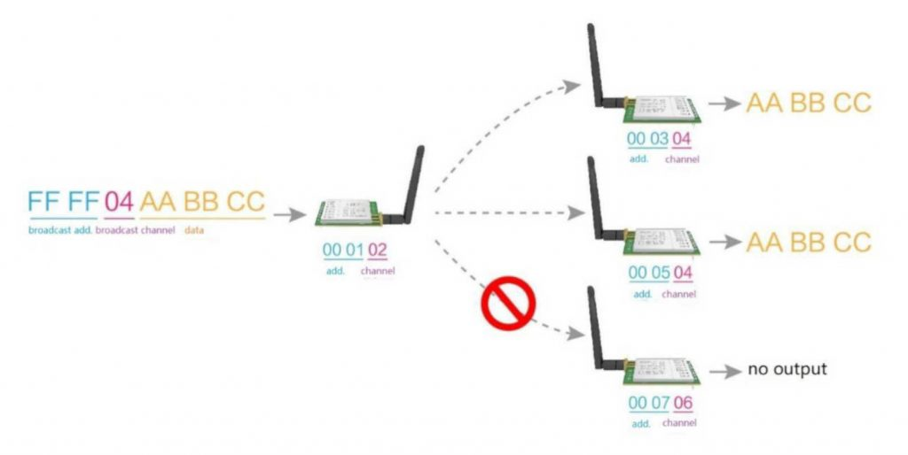
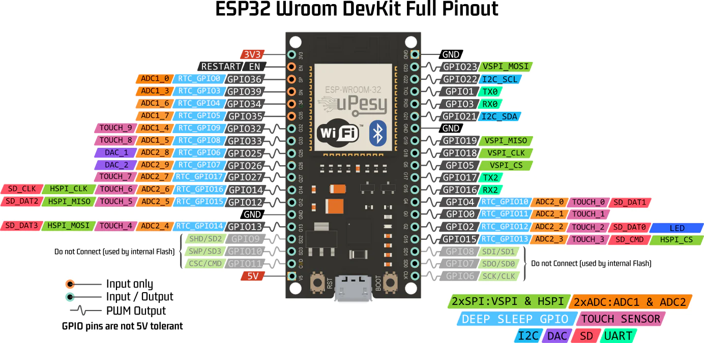

# Modules LoRa

- [Modules LoRa](#modules-lora)
  - [LoRa/MQTT](#loramqtt)
  - [Module LoRa E32-900T30D](#module-lora-e32-900t30d)
    - [Brochage](#brochage)
    - [Modes de fonctionnement](#modes-de-fonctionnement)
    - [Paramètres par défaut](#paramètres-par-défaut)
    - [Transmission](#transmission)
    - [Exemples ESP32](#exemples-esp32)
    - [Liens](#liens)

## LoRa/MQTT

Les messages sont envoyés par des « _publishers_ » (la passerelle LoRa) sur un « _topic_ » (canal de communication) à un « _broker_ » (serveur Raspberry Pi Zero).

Ces messages peuvent être lus par des « _subscribers_ » (les applications de supervision Mobile et/ou Desktop).

> Les « _publishers_ » et « _subscribers_ » sont considérés comme des « clients » MQTT. Le « _broker_ » est vu comme un serveur MQTT. Les « _topics_ » peuvent avoir une hiérarchie qui permettra de sélectionner les informations.

Les données des modules LoRa sonde et détection (répartis dans les différentes salles) sont envoyées vers la passerelle LoRa.

Les messages LoRa ont la structure suivante : `nom/type/donnee`

- Le champ `nom` indique le nome de la salle, par exemple : `B20`, `B11`, ...
- Le champ `type` peut prendre les valeurs suivantes : `temperature|humidite|confort|luminosite|co2|air|fenetres|lumieres|occupation`
- le champ `donnee` correspond à la valeur pour le `type`

Exemple `B20/temperature/20.5` : La **température** dans la salle **B20** est de **20.5** °Celsius.

La passerelle LoRa/MQTT "publie" les messages LoRa reçus sur le topic `salles` du serveur MQTT.

> Racine de la hiérarchie des topics : `salles`

Les données des modules LoRa sonde et détection sont donc publiées sur le topic : `salles/nom/type`

- Le champ `nom` indique le nome de la salle, par exemple : `B20`, `B11`, ...
- Le champ `type` peut prendre les valeurs suivantes : `temperature|humidite|confort|luminosite|co2|air|fenetres|lumieres|occupation`

Exemple : La donnée `20.5` associé au topic `salles/B20/temperature` sera une température en Celsius.

Les topics pour une salle, ici **B20** :

```
salles/B20/temperature
salles/B20/humidite
salles/B20/confort
salles/B20/luminosite
salles/B20/co2
salles/B20/air
salles/B20/fenetres
salles/B20/lumieres
salles/B20/occupation
```

Deux « _wild-cards_ » (jokers) sont utilisables dans les topics : `+` et `#` :

- `+` : sujet unique. Par exemple : `salles/+/temperature` sera abonné pour recevoir la température de toutes les salles (`salles/B20/temperature`, `salles/B11/temperature`, ...
- `#` : multi-sujets. Par exemple : `salles/#` sera abonné à toutes les données de toutes les salles (`salles/B20`, `salles/B11`, ...)


## Module LoRa E32-900T30D

E32-900T30D est un module de transmission sans fil, via un port série (UART TTL), basé sur la puce RF SX1276 de SEMTECH. Il dispose de plusieurs modes de transmission fonctionnant dans la technologie LoRa 862 MHz ~ 931 MHz.



### Brochage

|Broche|E/S|Description|
|:---:|:---:|---|
|M0|Input|Utilisé avec M1 pour définir un des 4 modes de fonctionnement|
|M1|Input|Utilisé avec M0 pour définir un des 4 modes de fonctionnement|
|RX|Input|Entrée TTL UART à connecter à un TX externe|
|TX|Output|Sortie TTL UART à connecter à un RX externe|
|AUX|Output|Indique l'état de fonctionnement du module|

### Modes de fonctionnement

|     |Mode |M1   |M0   |Description|Remarque|
|:---:|:---:|:---:|:---:|-----------|--------|
|0|Normal|0|0|Transmission transparente active|Le récepteur doit fonctionner en mode 0 ou en mode 1|
|1|Wake up|0|1|Idem mode 0, mais un  préambule est ajouté pour permettre le réveil du récepteur (qui est en mode 3)|Le récepteur peut être en mode 0, 1 ou 2|
|2|Power saving|1|0|UART désactivé et en mode WOR (_wake on radio_) pour la réception de données|impossible de transmettre dans ce mode|
|3|Sleep|1|1|mode veille (pas de transmission ni de rception)|le réglage des paramètres est possible|

### Paramètres par défaut

|Model|Frequency|Address|Channel|Air data rate|Baud rate|Format|Transmitting power|
|:---:|:---:|:---:|:---:|:---:|:---:|:---:|:---:|
|E32-900T30D|868 MHz|0x0000|0x06|2.4 kbps|9600|8N1|1W|

> 862M + CHANNEL*1M = 868MHz, pour 0x06 par défaut

Avec la bibliothèque EByte LoRa E32 :

```txt
HEAD : C0

ADDH    : 0
ADDL    : 0
CHANNEL : 6 -> 868MHz

FormatUART         : 0 -> 8N1 (Default)
SpeedUART          : 11 -> 9600bps (default)
SpeedAirDataRate   : 10 -> 2.4kbps (default)
OptionTransmission : 0 -> Transparent transmission (default)
OptionPullup       : 1 -> TXD, RXD, AUX are push-pulls/pull-ups
OptionWakeup       : 0 -> 250ms (default)
OptionFEC          : 0 -> Turn off Forward Error Correction Switch
OptionPower        : 0 -> 20dBm (Default)
```

### Transmission



En résumé :



> https://www.mischianti.org/2019/10/15/lora-e32-device-for-arduino-esp32-or-esp8266-specs-and-basic-usage-part-1/

- _Fixed transmission_



- _Broadcasting transmission_



> Adresse de _broadcast_ : `0xFFFF`

### Exemples ESP32



- Mode normal

|E32-900T30D|-----|ESP32|
|:---:|:---:|:---:|
|M0|-----|GND|
|M1|-----|GND|
|TX|-----|RX2 (_PullUp_)|
|RX|-----|TX2 (_PullUp_)|
|AUX|-----|Non connecté|

- PlatformIO (`platformio.ini`) :

```ini
[env:esp32dev]
platform = espressif32
board = esp32dev
framework = arduino
lib_deps =
upload_port = /dev/ttyUSB0
upload_speed = 115200
monitor_port = /dev/ttyUSB0
monitor_speed = 115200
```

- Principe :

```cpp
#include "Arduino.h"

void setup()
{
  Serial.begin(9600); // moniteur série
  delay(500);

  Serial2.begin(9600); // lora
  Serial2.println("Hello, world?"); // émission
}

void loop()
{
  if (Serial2.available())
  {
     // affiche les données reçues dans le moniteur
    Serial.write(Serial2.read());
  }
  if (Serial.available())
  {
    // transmet les données saisies dans le moniteur
    Serial2.write(Serial.read());
  }
}
```

- PlatformIO (`platformio.ini`) et bibliothèque LoRa_E32_Series_Library :

```ini
[env:esp32dev]
platform = espressif32
board = esp32dev
framework = arduino
lib_deps =
  xreef/EByte LoRa E32 library@^1.5.10
upload_port = /dev/ttyUSB0
upload_speed = 115200
monitor_port = /dev/ttyUSB0
monitor_speed = 115200
```

> https://github.com/xreef/LoRa_E32_Series_Library et https://registry.platformio.org/libraries/xreef/EByte%20LoRa%20E32%20library

|E32-900T30D|-----|ESP32|
|:---:|:---:|:---:|
|M0|-----|GND|
|M1|-----|GND|
|TX|-----|RX2 (_PullUp_)|
|RX|-----|TX2 (_PullUp_)|
|AUX|-----|Non connecté ou D18|

```cpp
#include "Arduino.h"
#include "LoRa_E32.h"

#define MO_PIN  21
#define M1_PIN  19
#define AUX_PIN 18

LoRa_E32 e32Lora(&Serial2, AUX_PIN, MO_PIN, M1_PIN); // RX/TX AUX M0 M1

void setup()
{
  Serial.begin(9600); // moniteur série
  delay(500);

  e32Lora.begin();

  // Emission d'un message
  ResponseStatus rs = e32Lora.sendMessage("Hello, world?");
  // Affiche l'état de la commande d'émission
  Serial.println(rs.getResponseDescription());
}

void loop()
{
  if (e32Lora.available())
  {
    // Réceptionne un message
    ResponseContainer rc = e32Lora.receiveMessage();

    if (rc.status.code == 1)
    {
        // Affiche l'état de la commande d'émission
        Serial.println(rc.status.getResponseDescription());
        // Affiche les données reçues
        Serial.println(rc.data);
    }
    else
    {
        // Problème
        Serial.println(rc.status.getResponseDescription());
    }
  }
  if (Serial.available())
  {
        // transmet les données saisies dans le moniteur
        String message = Serial.readString();
        e32Lora.sendMessage(message);
  }
}
```

> La configuration du module est décrit dans cet article : https://www.mischianti.org/2019/10/29/lora-e32-device-for-arduino-esp32-or-esp8266-configuration-part-3/ et https://www.mischianti.org/2019/11/10/lora-e32-device-for-arduino-esp32-or-esp8266-fixed-transmission-part-4/

### Liens

Module E32-900T30D (SX1276 LoRa)

- https://www.ebyte.com/en/product-view-news.html?id=1525
- https://www.amazon.fr/EBYTE-Modulation-Transmetteur-E32-900T30D-Antenne/dp/B09DYGG2TC

Bibliothèque

- https://github.com/xreef/LoRa_E32_Series_Library
- https://registry.platformio.org/libraries/xreef/EByte%20LoRa%20E32%20library

Tutoriel

- https://www.mischianti.org/2019/10/15/lora-e32-device-for-arduino-esp32-or-esp8266-specs-and-basic-usage-part-1/

---
Thierry Vaira : **[thierry(dot)vaira(at)gmail(dot)com](thierry.vaira@gmail.com)**
